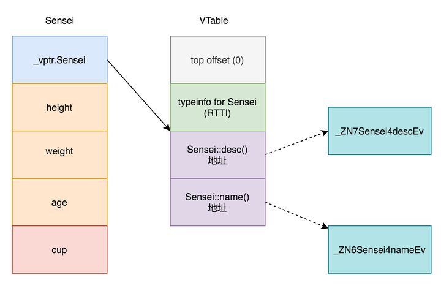
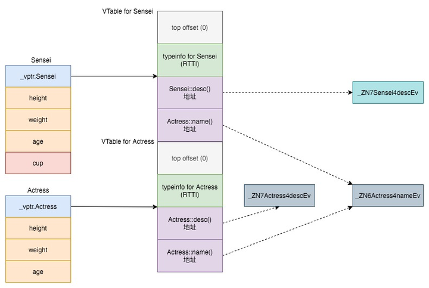

# Legacy

## 基础

### 函数

#### 调用过程

- 程序执行 call 指令，把下一条指令的地址存在栈中，修改 rip 为目标指令的地址，跳转并开始执行函数。
- 记录栈帧 rbp，将当前栈顶 rsp 赋值给 rbp，如果该函数还会调用其他函数，rsp 向下拓展一定的大小。
- 根据调用约定，把参数存入寄存器或压入栈中，Linux 默认使用 cdecl，参数从右往左压栈，fastcall 反之。
- 执行函数体内的指令，在 ret 之前，将返回值存在 rax 中，并恢复原始的栈帧 rbp，原始的指令地址 rip。

#### 调用约定

 调用约定描述了被调用代码的接口：[21]

- 极微参数或复杂参数独立部分的分配顺序；
- 参数是如何被传递的（放置在堆栈上，或是寄存器中，亦或两者混合）；
- 被调用者应保存调用者的哪个寄存器；
- 调用函数时如何为任务准备堆栈，以及任务完成如何恢复。

这与编程语言中对于大小和格式的分配紧密相关。[21]

另一个密切相关的是名字修饰，这决定了代码中的符号名称如何映射到链接器中的符号名。[21]

**调用约定**，**类型表示**和**名称修饰**这三者的统称，即是众所周知的应用二进制接口（ABI）。[21]

#### Caller 保护和 Callee 保护

[22]

### 关键字

#### static

#### inline

##### 内联函数

- 如果函数的执行时间少于从调用者函数到被调用函数的切换时间，则这可能会成为开销。[15]
- C++ 提供了 inline 函数，以减少函数调用的开销，由编译器在编译阶段，将 IR 在对应位置展开。[15]
- 优点是函数调用的开销小，使用比宏方便，缺点是因展开而增加目标码的大小，且调试困难。[15]
- **inline 只是对编译器提出申请，并不是强制命令，编译器在以下情况可能会忽略内联请求：**[15]
  - 函数包含循环；
  - 函数包含递归；
  - 函数包含静态变量；
  - 函数包含 switch 或 goto 语句；
  - 函数的返回类型不是 void，并且函数主体中不存在 return 语句。
- 大多数 virtual 函数不能内联，因为直到运行时才知道调用哪个函数，而 inline 是在执行前进行替换。[15]
- 此外，对于通过函数指针进行的调用，编译器通常不会内联。[15]

##### 允许函数在多个编译单元中存在

- inline 关键字修饰的函数，写在头文件中，允许在多个编译单元中重复存在，即被多个 cpp 文件 include。[16]
- 编译单元就是 cpp 文件，写在 cpp 文件中，只能被当前编译单元使用，无法被其它编译单元链接后调用。[16]
- 在头文件中、类内定义的函数和模板函数，被隐式声明为 inline 函数，无需添加 inline 标记，此时并非内联。[16]

### 编译

- 预处理代码，展开 include 和宏。
- 

## 宏

[20]

## OOP

### 原理

```c
// 写法一
#include <stdio.h>
typedef struct Actress {
    int height; // 身高
    int weight; // 体重
    int age;    // 年龄（注意，这不是数据库，不必一定存储生日）

    void (*desc)(struct Actress*);
} Actress;

// obj中各个字段的值不一定被初始化过，通常还会在类内定义一个类似构造函数的函数指针，这里简化
void profile(Actress* obj) {
    printf("height:%d weight:%d age:%d\n", obj->height, obj->weight, obj->age);
}

int main() {
    Actress a;
    a.height = 168;
    a.weight = 50;
    a.age = 20;
    a.desc = profile;

    a.desc(&a);
    return 0;
}
```

- 类的实质是将数据和操作封装，让一个 struct 里可以包含方法，但如果用函数指针实现，显然浪费空间。[1]
- 所以类方法的实现，只是给一个面向过程的函数，传递了 self 参数，让它看起来和类的数据相关联而已。[1]

### 成员和继承

##### 方法实现 [16]

对 C++ 来说，将成员函数定义在 class 里边跟定义在外边有什么区别？

- 头文件将会被多次编译，而源文件只编译一次，因此将代码放进源文件能够提升编译速度。[16]
- 解决编译依赖，一个类 classA 函数实现依赖 classB，放进 cpp 而非头文件，在其他地方引入 classA 的时候，不依赖 classB。[16]

##### 成员类型 [14]

- public：可以内部、外部访问。
- protected：可以被内部、子类内部访问。
- private：只可以被内部访问。

##### 继承类型 [14]

- public：父类的 public 和 protected 成员分别 Copy 到子类的 public 和 protected 区域中；父类的 private 成员被分到一个特殊的区域里面，只能用父类原有的函数来访问。
- protected：父类的 public 和 protected 成员 Copy 到子类的 protected 区域中；父类的 private 成员仍然被分到一个特殊的区域里面，只能用父类原有的函数来访问。
- private：父类的 public 和 protected 成员 Copy 到子类的 private 区域中；父类的 private 成员仍然被分到一个特殊的区域里面，只能用父类原有的函数来访问。

### 问题

#### C++ 类的循环引用怎么解决？

```c++
#include<iostream>
using namespace std;
class CCar;  // 提前声明 CCar 类，以便后面的 CDriver 类使用
class CDriver {
public:
    void ModifyCar(CCar* pCar);  // 改装汽车
};
class CCar {
private:
    int price;
    friend int MostExpensiveCar(CCar cars[], int total);  // 声明友元
    friend void CDriver::ModifyCar(CCar* pCar);  // 声明友元
};
void CDriver::ModifyCar(CCar* pCar) {
    pCar->price += 1000;  // 汽车改装后价值增加
}
int MostExpensiveCar(CCar cars[], int total) {  // 求最贵气车的价格
    int tmpMax = -1;
    for (int i = 0; i<total; ++i)
        if (cars[i].price > tmpMax)
            tmpMax = cars[i].price;
    return tmpMax;
}
```

- 第 3 行声明了 CCar 类，CCar 类的定义在后面。之所以要提前声明，是因为 CDriver 类的定义中用到了 CCar 类型（第 7 行），而此时 CCar 类还没有定义，编译会报错。不要第 3 行，而把 CCar 类的定义写在 CDriver 类的前面，是解决不了这个问题的，因为 CCar 类中也用到了 CDriver 类型（第14行），把 CCar 类的定义写在前面会导致第 14 行的 CDriver 因没有定义而报错。[12]

- C++ 为此提供的解决办法是：可以简单地将一个类的名字提前声明，尽管可以提前声明，但是在一个类的定义出现之前，仍然不能有任何会导致该类对象被生成的语句。但使用该类的指针或引用是没有问题的。[12]
- 另外，该案例中使用到了友元，在类内声明 friend 函数，在类外实现，使得这个函数虽然不在类内，依然能够获取到类的 private 和 protected 成员。[12]

## 多态

### 原理

- **静态连编时，系统用实参与形参进行匹配，对于同名的重载函数变根据参数上的差异进行区分，然后进行连编，从而实现编译时的多态。（注意：函数的选择是基于指向对象的指针类型或者引用类型）**

- **动态连编是运行阶段完成的连编。即当程序调用到某一函数的时候，系统会根据当前的对象类型去寻找和连接其程序的代码，对面向对象的程序而言，就是当对象收到某一消息的时候，才去寻找和连接相应的方法。（函数的选择是基于对象的类型）。**

#### 动态多态 / 运行时多态

- 虚函数：被标记为 virtual 的函数，见词条虚函数。

- 继承：子类继承自父类，拥有父类的成员变量和函数。

- 重写（覆盖）：被父类标记为 virtual 的函数，在子类中定义它的同名同参函数，通过父类指针调用子类实例，会调用到子类函数。[7]

- 隐藏：子类的函数屏蔽了与其同名的父类函数，即除了重写之外，子类与父类函数同名的情况。[7]

#### 静态多态 / 编译时多态

- 模板：被标记为 template 的函数或类，见词条泛型。
- 友元：被标记为 friend 的函数或类，见词条友元。

- 函数重载：在同一个类或者在同一个域中，重载利用倾轧技术改函数名，区分参数不同的同名函数。[8]

- 运算符重载：编写以运算符作为名称的函数，自己定义它的左元、右元和返回值，本质是函数重载。[9]

### 问题

#### C++ 的多态都有哪些体现？

静态多态、动态多态、模板、友元、继承、虚函数、重写（覆盖/override）、隐藏、函数重载（overload）、运算符重载。

#### 重载、覆盖和隐藏的区别？

- 成员函数被重载的特征：[6]
  - 相同的范围（在同一个类中）；
  - 函数名字相同；
  - 参数不同；
  - virtual 关键字可有可无。

- 覆盖是指派生类函数覆盖基类函数：[6]
  - 不同的范围（分别位于派生类与基类）；
  - 函数名字相同；
  - 参数相同；
  - 基类函数必须有virtual 关键字。

- 隐藏是指派生类的函数屏蔽了与其同名的基类函数：[6]
  - 如果派生类的函数与基类的函数同名，但是参数不同。此时，不论有无virtual关键字，基类的函数将被隐藏（注意别与重载混淆）。
  - 如果派生类的函数与基类的函数同名，并且参数也相同，但是基类函数没有virtual 关键字。此时，基类的函数被隐藏（注意别与覆盖混淆）

#### 类的构造函数调用顺序是怎样的？

基类构造函数、对象成员构造函数、派生类本身的构造函数。[3]

#### 类的析构函数调用顺序是怎样的？

派生类本身的析构函数、对象成员析构函数、基类析构函数。[3]

## Virtual

### 原理

#### 虚函数





- 在指针上转的情况下，怎么通过父类指针调用子类的函数？普通函数是和指针（如何查看内存结构）绑定的，而虚函数是和实例绑定的。[1]
- 在编译阶段为每个具有虚函数的类（可能是本身有，也可能继承自父类），生成一个 vtable 记录调用某个名字的函数时应该跳转的地址。[1]
- vtable 存储在 .rodata，实例开头有个 vptr，指向这个类对应的 vtable，调用子类重写过的虚函数，查找的是子类 vtable，故而正确调用。[1]

#### 虚继承

##### 多继承

C++ 支持多重继承，Java 不支持多重继承，只支持单继承 + 接口的形式来派生类的。假如有一天你流落荒岛，岛上有两种美人鱼可以陪伴你度过荒岛余生，你选择哪种？[2]


姑且称A为美人鱼，B为鱼美人。美人鱼和鱼美人都是继承自美人类和鱼这两个 class 的。这便是一个典型的多重继承的例子——多重继承有个特点就行继承的类是有顺序的！[2]

```cpp
class A: public Beauty, Fish {};
class B: public Fish, Beauty {};
```

上述两个子类 A 和 B 对两个基类 Beauty 和 Fish 的继承顺序不同，导致它们的内存结构大不相同，一个是 Beauty 的成员在前，一个是 Fish 的成员在前，而继承的**两个虚表指针**在各自实例内存的头部，没错，单继承无论继承多少层，都只有一个 vptr，而多继承会导致有多个 vptr。[2]

```cpp
class Father {
public:
    virtual void fun() {
        cout << "Father Fun." << endl;
    }
};
class Mother {
public:
    virtual void fun() {
        cout << "Monther Fun." << endl;
    }
};
class Son: Father, Mother {
public:
    void fun() override {
        cout << "Son Fun." << endl;
    }
};
int main() {
    cout << sizeof(Father) << endl;
    cout << sizeof(Mother) << endl;
    cout << sizeof(Son) << endl;
    return 0;
}
```

这段代码输出 8 8 16。[2]

##### 菱形继承

两个不同的子类继承于同一个父类，又有一个孙类多继承于这个两个子类时，父类中的一个属性被两个子类继承，导致孙类从这两个不同的子类得到两个同名属性，造成歧义。[13]

```cpp
class Grand {
public:
    int age = 80;
};
class Father : public Grand {};
class Mother : public Grand {};
class Son : public Father, public Mother {};
int main() {
    Son son;
    cout << son.age << endl; 
    return 0;
}
```

输出 `error: request for member 'age' is ambiguous`，解决方法有两种：[13]

- 手动写明作用域，让编译器不再对歧义困惑 `cout << son.Father::age << endl; `。
- 利用虚继承，关键字 virtual 解决 `class Father : virtual public Grand {}`（注意两个父类都要加 virtual，否则还是会歧义！）。

在不使用虚继承时，查看 `sizeof(son)` 大小是 4 + 4 = 8，使用虚继承时，大小是 24，因为多了 8 + 8 两个虚表的大小，然后 int 被对其成占 8 位。[13]

**vptr 指向 vtable，在虚基类表中记录着偏移量，比如 Father 中的偏移量就是 16，基地址是0，0 + 16 = 16，自然指向地址为 16 的 age，Mother 中的偏移量是 8，自身的基地址是8，8 + 8 = 16，同样也指向了地址为 16 的 age，这样 son.age、son.Father::age 和 son.Mother::age 的内存就是同一个内存，也就消除了 son.age 的歧义。**[13]

##### vtable

总之虚表的作用就是，将多个入口，映射到同一块内存地址上去。[2]

- 用在函数上，是将多个类型的上转指针，映射到实例对应的虚函数。
- 用在继承上，是将多个父类的同名成员，映射到实例对应的真正成员。

### 问题

#### 构造函数可以是虚函数吗？

不可以，实例构造之前还没有指向虚函数表的 vptr 指针，也存在逻辑悖论，无法确定要构造哪个实例。[3]

#### 析构函数可以是虚函数吗？

可以，而且尽量要设为虚函数，否则在指针上转的情况下，析构的时候调用不到子类，造成内存泄漏。[3]

#### 虚函数表中除了函数指针外还有什么数据？

一个类的 vtable 数据中，除了后面的函数指针，前面还有两个字段，各占一个指针的大小。[2]

- top_offset 给多继承指定偏移，在调用虚函数之前对 this 指针进行调整，帮它找到它应该调用的那个函数，这个方法也成 thunk。
- type_info 是子类的类型信息数据，无论是多继承中的哪个类的虚表，都是指向相同的地址。

## 泛型

### 原理

#### 函数模板

##### 函数模板的形式 [10]

```cpp
template <class 类型参数1，class 类型参数2，...>
返回值类型 模板名 (形参表) {
    函数体
};
```

`template` 就是模板定义的关键词，`类型参数` 代表的是任意变量的类型，定义好「函数模板」后，在编译的时候，编译器会根据传入 `模板名` 函数的参数变量类型，自动生成对应参数变量类型的 `模板名` 函数。

##### 函数模板的重载 [10]

```cpp
// 模板函数 1
template<class T1, class T2>
void print(T1 arg1, T2 arg2) {
    cout<< arg1 << " "<< arg2<<endl;
}
// 模板函数 2
template<class T>
void print(T arg1, T arg2) {
    cout<< arg1 << " "<< arg2<<endl;
}
// 模板函数 3
template<class T,class T2>
void print(T arg1, T arg2) {
    cout<< arg1 << " "<< arg2<<endl;
}
```

函数模板可以重载，只要它们的**形参表或类型参数表**不同即可。

##### 函数模板的调用次序 [10]

在有多个函数和函数模板名字相同的情况下，编译器如下规则处理一条函数调用语句： 1. 先找参数完全匹配的普通函数（非由模板实例化而得的函数）； 2. 再找参数完全匹配的模板函数； 3. 再找实参数经过自动类型转换后能够匹配的普通函数； 4. 上面的都找不到，则报错。

#### 类模板

##### 类模板的形式 [10]

```cpp
template <class 类型参数1，class 类型参数2，...> //类型参数表
class 类模板名 {
   成员函数和成员变量
};
类模板名<真实类型参数表> 对象名(构造函数实参表);
```

为了多快好省地定义出一批**相似的类**，可以定义「类模板」，然后**由类模板生成不同的类**。

##### 类模板中有函数模板 [10]

```cpp
template <class T>
class A {
public:
    template<class T2>
    void Func(T2 t) { cout << t; } // 成员函数模板
};
int main() {
    A<int> a;
    a.Func('K');     //成员函数模板 Func被实例化
    a.Func("hello"); //成员函数模板 Func再次被实例化
    return 0;
}
```

当函数模板作为类模板的成员函数时，是可以单独写成函数模板的形式，成员函数模板在使用的时候，编译器才会把函数模板根据传入的函数参数进行实例化。

##### 类模板的非类型参数 [10]

```cpp
template <class T, int size>
class CArray {
public:
    void Print( ) {
        for( int i = 0;i < size; ++i)
        cout << array[i] << endl;
    }
private:
    T array[size];
};
CArray<double, 40> a2;
CArray<int, 50> a3;
```

类模板的“<类型参数表>”中可以出现非类型参数，a2 和 a3 属于不同的类。

##### 类模板和模板类的区别 [10]

类模板是 `A<T>`，模板类是 `A<int>`，前者的 T 是不确定的，后者的 int 是确定的。

类模板可以从模板类中派生，也可以从类模板中派生，也可以和普通类互相派生。

##### 类模板中定义静态变量 [10]

```cpp
template <class T>
class A {
private:
    static int count; // 静态成员
public:
    A() { count ++; }
    ~A() { count -- ; };
    A( A & ) { count ++ ; }
    static void PrintCount() { cout << count << endl; } // 静态函数
};
template<> int A<int>::count = 0;    // 初始化
template<> int A<double>::count = 0; // 初始化

int main()
{
    A<int> ia;  
    A<double> da; // da 和 ia 不是相同模板类
    ia.PrintCount();
    da.PrintCount();
    return 0;
}
```

类模板中可以定义静态成员，那么从该类模板实例化得到的所有类，都包含同样的静态成员。

#### 特化

模板特化指实现某个函数/类模板的某个特例，达到特殊情况特殊处理的目的。如 template<typename A, typename B>，偏特化为 template<int, typename B>，对于 A 确定为 int，B 不能确定的情况特殊定义，全特化为 template<int, bool>，对于 A 确定为 int，B 确定为 bool 的情况特殊定义。

##### 类模板 [17]

```text
// 模板类
template<class T1,class T2>
class Test
{
public:
	Test(T1 a, T2 b):_a(a),_b(b) {
		cout << "模板化" << endl;
	}
private:
	T1 _a;
	T2 _b;
};
// 模板类全特化
template<>
class Test<int, int> {
public:
	Test(int a, int b) :_a(a), _b(b) {
		cout << "模板全特化" << endl;
	}
private:
	int _a;
	int _b;
};
// 模板类偏特化
template<class T>
class Test<int, T> {
public:
	Test(int a, T b) :_a(a), _b(b) {
		cout << "模板偏特化" << endl;
	}
private:
	int _a;
	T _b;
};
```

##### 函数模板 [17]

```text
// 普通模板
template<class T1,class T2>
bool Compare(T1 a, T2 b) {
	cout << "普通模板" << endl;
	return a == b;
}
// 函数模板特化
template<>
bool Compare(const char* a, const char* b) {
	cout << "函数模板特化" << endl;
	return strcmp(a,b) == 0;
}
```

##### 总结 [17]

- 函数模板只有全特化，没有偏特化；
- 模板函数不能是虚函数，因为每个包含虚函数的类具有一个 virtual table，包含该类的所有虚函数的地址，因此 vtable 的大小是确定的。模板只有被使用时才会被实例化，将其声明为虚函数会使 vtable 的大小不确定。

### 问题

## 友元

### 原理

- 私有成员只能在类的成员函数内部访问，如果想在别处访问对象的私有成员，只能通过类提供的接口（成员函数）间接地进行。这固然能够带来数据隐藏的好处，利于将来程序的扩充，但也会增加程序书写的麻烦。C++ 是从结构化的C语言发展而来的，需要照顾结构化设计程序员的习惯，所以在对私有成员可访问范围的问题上不可限制太死。[12]

- C++ 设计者认为， 如果有的程序员真的非常怕麻烦，就是想在类的成员函数外部直接访问对象的私有成员，那还是做一点妥协以满足他们的愿望为好，这也算是眼前利益和长远利益的折中。因此，C++ 就有了**友元（friend）**的概念。打个比方，这相当于是说：朋友是值得信任的，所以可以对他们公开一些自己的隐私。[12]

#### 友元函数

##### 友元函数的声明 [12]

- 将全局函数声明为友元的写法如下：
  
  `friend 返回值类型 函数名(参数表);`
- 将其他类的成员函数声明为友元的写法如下：
  
  `friend 返回值类型 其他类的类名::成员函数名(参数表);`
- 但是，不能把其他类的私有成员函数声明为友元。

##### 友元类的声明 [12]

- 在类定义中声明友元类的写法如下：
  
  `friend class 类名;`
  
- 一个类 A 可以将另一个类 B 声明为自己的友元，类 B 的所有成员函数就都可以访问类 A 对象的私有成员。

### 问题

# Modern

## concept

## 异常

### 原理

- 编译器会将 `throw` 语句翻译成一对 `libstdc++` 库里的函数，包括为异常处理分配内存、调用 `libstdc` 来进行栈展开（stack unwinding）。[4]
- 对于每个 `catch` 语句的存在，编译器会在函数末尾加上一些特殊信息，包括当前函数可以捕获的异常表，以及清理表（cleanup table）。[4]
- 在进行栈展开时，会调用 `libstdc++` 提供的特殊函数（称为 personality routine），会检查栈上的所有函数哪个异常可以被捕获。[4]
- 如果异常无法被捕获，那么 `std::terminate` 就会被调用；如果找到了能够匹配的捕获操作，展开处理（unwinder）会再次在栈顶进行操作。[4]
- unwinder 第二次遍历栈时，会要求 personality routine 去为当前函数执行清理操作，这会引起每个在当前作用域分配的对象的析构操作。[4]
- personality routine 检查当前函数的清理表，如果有清理操作要执行，就会直接跳到当前栈帧（stack frame），执行清理操作（cleanup code）。[4]
- 一旦 unwinder 到达了可以处理异常的栈帧时，它会跳到对应的 `catch` 语句当中，执行完 `catch` 后调用清理函数去释放掉为异常所分配的内存。[4]

# 参考

[1] C++ 为什么要弄出虚表这个东西？ - 果冻虾仁的回答 - 知乎 https://www.zhihu.com/question/389546003/answer/1194780618

[2] C++ 里虚表的前两个字段有什么作用？ - 果冻虾仁的回答 - 知乎 https://www.zhihu.com/question/29251261/answer/1297439131

[3] C++ 面试：构造函数和析构函数可以是虚函数吗 - 芒果的文章 - 知乎 https://zhuanlan.zhihu.com/p/611831152

[4] C++ 异常是如何实现的 - 左沙的文章 - 知乎 https://zhuanlan.zhihu.com/p/406894769

[5] C++ 多态全方面详解。 - C语言资深大师的文章 - 知乎 https://zhuanlan.zhihu.com/p/537860116

[6] 重载(overload)、覆盖(override)、隐藏(hide)的区别  https://www.cnblogs.com/txwsh1/archive/2008/06/28/1231751.html

[7] C++多态全方面详解。 - C语言资深大师的文章 - 知乎 https://zhuanlan.zhihu.com/p/537860116

[8] 解析 C++ 中函数重载的实现原理 - CSDN https://blog.csdn.net/qq_40840459/article/details/78510939

[9] 运算符重载概念及实现原理 - 博客园 https://www.cnblogs.com/lasnitch/p/12764281.html

[10] C++ 模板常见特性（函数模板、类模板） - 小林coding的文章 - 知乎 https://zhuanlan.zhihu.com/p/101898043

[12] C++友元函数和友元类（C++ friend）详解 - C 语言中文网 http://c.biancheng.net/view/169.html

[13] C++ 中类的菱形继承问题 - 神皇境剑修的文章 - 知乎 https://zhuanlan.zhihu.com/p/395173418

[14] C++ _ 类的三种继承 - windand的文章 - 知乎 https://zhuanlan.zhihu.com/p/51201155

[15] C++ inline 关键字详解 - 不知味之味的文章 - 知乎 https://zhuanlan.zhihu.com/p/151995167

[16] C++ inline 有什么用？？ - pansz的回答 - 知乎 https://www.zhihu.com/question/24185638/answer/2870964362

[17] C++ 模板  全特化与偏特化 - 飞翔的猪的文章 - 知乎 https://zhuanlan.zhihu.com/p/346400616


[20] Macros (The C Preprocessor) (gnu.org) https://gcc.gnu.org/onlinedocs/cpp/Macros.html

[21] X86调用约定 - 维基百科，自由的百科全书 (wikipedia.org) https://zh.wikipedia.org/wiki/X86调用约定

[22] 为什么要区分caller saved和callee saved registers? - 知乎 (zhihu.com) https://www.zhihu.com/question/453450905