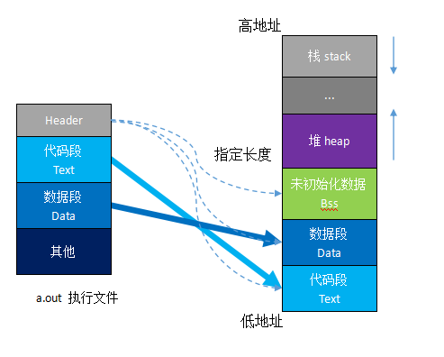
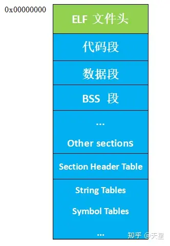

## 内存

### 对齐

结构体 / Union / class 会进行内存对齐。

#### 原则

- 结构体的总大小，必须要是其内部最大成员的整数倍，不足的要补齐。[1]

- 结构体第一个数据成员 offset = 0，子成员要根据类型存放在对应的整数倍的地址上。[1]

- 如果结构体作为成员，则要找到这个结构体中的最大元素，然后从这个最大成员的整数倍地址开始存储。[1]

#### 原因

- 平台原因：某些体系结构只能访问对齐的内存数据，否则抛出硬件异常。[2]
- 性能原因：防止不对齐的数据跨越 Cache Line，导致取数据需要取两次。[2]

### 分段



#### 文件



- ELF 文件包含三种类型：可重定位文件（*.o）、可执行文件、以及共享库（share library）。[3]
- 代码段（.text）是可执行指令的集合，数据段（.data）和 BSS 段（.bss）是数据的集合，其中 .data 是已经初始化的数据，.bss 是未初始化的数据。[3]
- 从可执行程序的角度来说，如果一个数据未被初始化，就不需要为其分配空间，所以 .data 和 .bss 的区别就是 .bss 并不占用可执行文件的大小，仅仅记录需要用多少空间来存储这些未初始化的数据。[3]

#### 程序


## 异步

### 进程

#### 概念

是并发执行的程序在执行过程中分配和管理资源的基本单位，是一个动态概念，竞争计算机系统资源的基本单位。[4]
#### 创建

### 线程

#### 概念

是进程的一个执行单元，是进程内科调度实体。比进程更小的独立运行的基本单位。线程也被称为轻量级进程。[4]

#### 创建

##### 使用函数指针创建新线程 [5]

```cpp
void thread_function() {}
int main() {
    std::thread threadObj(thread_function);
    threadObj.join();
    return 0;
}
```

##### 使用函数对象创建新线程 [5]

```cpp
class ThreadClass {
public:
    void operator() () {}
};
int main() {
    std::thread threadObj((ThreadClass()));
    threadObj.join();
    return 0;
}
```

##### 使用 lambda 函数创建新线程 [5]

```cpp
int main() {
    std::thread threadObj([]{});
    threadObj.join();
    return 0;
}
```

#### 获取 ID

```cpp
std::thread::get_id()
```

#### Join 和 Detach

- `join()` 会阻塞调用线程，`detach()` 不会阻塞调用线程。[5]
- 当调用一次 `join()` 或 `detach()` 之后，thread 对象就没有线程和它相关联了，再调用会导致程序终止，因此，每次调用 `join()` 和 `detach()` 前都应检查该线程是否是 `joinable` 的。[5]
- 若一个正在执行中的线程对象既没有被调用 `join()` 也没有被调用 `detach()`，则等到该对象析构时，会导致程序终止。因为在线程的析构函数中，若检查到线程仍然是 `joinable` 的，则会直接终止程序运行。[5]

#### 线程的传参

```cpp
void thread_function(int x, int const& y) {}
int main() {
    int x = 10, y = 20;
    std::thread threadObj(thread_function, x, std::ref(y));
    threadObj.join();
    return 0;
}
```

传引用需要用 `std::ref()` 包裹起来。[5]

```cpp
class ThreadClass {
public:
    void ThreadFunction(int x) {}
};
int main() {
    ThreadClass classObj;
    int x = 10;
    std::thread threadObj(&ThreadClass::ThreadFunction, &classObj, x);
    threadObj.join();
    return 0;
}
```

给类的成员函数传参，第二参数需要是实例，其他参数紧跟在后面。[5]

#### 互斥锁

`std::mutex mutex;`

`mutex.lock()` 和 `mutex.try_lock()` 上锁，`mutex.unlock()` 解锁。[5]

`mutex.lock()` 阻塞而 `mutex.try_lock()` 非阻塞，后者有个返回值 true/false 意为上锁成功/失败。[5]

### 协程

#### 概念

是一种比线程更加轻量级的存在。一个线程也可以拥有多个协程。其执行过程更类似于子例程，或者说不带返回值的函数调用。[4]

#### 创建

- 存储当前的返回地址。
- 将返回地址更改为协程的入口。
- 手动保存寄存器的值（上下文）。
- 调用 ret “返回” 到协程内部执行指令 。

### 问题

#### 线程和进程的区别？

- 进程切换的开销大，线程切换的开销小。[4]
- 进程消息通信复杂，线程数据共享简单。[4]
- 进程拥有独立的地址空间，线程共享进程的地址空间。[4]
- 进程崩了不对其他进程产生影响，线程崩了整个进程死掉。[4]
- 进程是资源分配最小的单位，线程是 CPU 调度最小的单位。[4]

#### 线程和协程的区别？

- 线程的切换由内核控制，协程的切换在用户态控制。[4]
- 线程是 CPU 层面的分时或同时异步，协程时线程层面的分时异步。[4]

#### 进程的通信方式？

- FIFO：任何进程间都能通信，但速度慢。[4]
- 信号量：不能传递复杂消息，只能用来同步。[4]
- 信号：向某个 pid 的进程发送不带数据的如 sigkill、sigterm 等信号。
- 消息队列：容量受到系统限制，且要注意第一次读的时候，要考虑上一次没有读完数据的问题。[4]
- 管道：单工，速度慢，容量有限，只有父子进程能通信（fork 后各两个 fd，一个关读一个关写）。[4]
- 共享内存区：能够很容易控制容量，速度快，但要保持同步，比如一个进程在写的时候，另一个进程要注意读写的问题。[4]

#### 何时使用多进程，何时使用多线程？

- 对资源的管理和保护要求高，不限制开销和效率时，使用多进程。[4]

- 要求效率高，频繁切换时，资源的保护管理要求不是很高时，使用多线程。[4]

#### 进程、线程和协程的创建？

- 一个程序能创建多个进程（fork）。
- 一个进程能创建多个线程。
- 一个线程能创建多个协程。

## 同步

### 锁

#### 乐观锁

乐观锁在操作数据时非常乐观，认为别人不会同时修改数据。[6]

因此乐观锁不会上锁，只是在执行更新的时候判断一下在此期间别人是否修改了数据，如果别人修改了数据则放弃操作，否则执行操作。[6]

##### CAS

flag 是 true 代表锁定，false 代表解锁，使用原子指令，将一个 true 和 flag 交换，若换出 true 代表已经被锁定，不要修改数据，若换出 false 代表没有被锁定，可以交换数据。许多CAS的操作是自旋的（spin lock），如果操作不成功，会一直重试，直到操作成功为止。[6]

##### 版本号

版本号机制的基本思路是在数据中增加一个字段 version，表示该数据的版本号，每当数据被修改，版本号加 1。

- 当某个线程查询数据时，将该数据的版本号一起查出来；
- 当该线程更新数据时，判断当前版本号与之前读取的版本号是否一致，如果一致才进行操作。

#### 悲观锁

悲观锁在操作数据时比较悲观，认为别人会同时修改数据。[6]

因此操作数据时直接把数据锁住，直到操作完成后才会释放锁，上锁期间其他人不能修改数据。[6]

##### std::mutex

### 信号量

#### 概念

信号量（semaphore）的数据结构为一个值和一个指针，指针指向等待该信号量的下一个进程。[7]

信号量的值与相应资源的使用情况有关，当它的值大于0时，表示当前可用资源的数量；当它的值小于0时，其绝对值表示等待使用该资源的进程个数。[7]

#### PV 操作

PV 操作由 P 操作原语和 V 操作原语组成（原语是不可中断的过程）。[7]

##### P 操作 [7]

- 将信号量 S 的值减1，即 S = S - 1；
- 如果 S >= 0，则该进程继续执行；否则该进程置为等待状态，排入等待队列。

##### V 操作 [7]

- 将信号量S的值加 1，即 S= S + 1；
- 如果 S > 0，则该进程继续执行；否则释放队列中第一个等待信号量的进程。

### 死锁

#### 条件

- **互斥条件**，它的意思是每个资源每次只能被一个线程（或进程，下同）使用。[8]
- **请求与保持条件**，它是指当一个线程试图获取资源，但发生了阻塞，则需对已获得的资源保持不放。[8]
- **不剥夺条件**，它是指线程已获得的资源，在未使用完之前，不会被强行剥夺。[8]
- **循环等待条件**，互相持有对方所需的资源，形成环路，依次等待下一个线程已持有的资源。[8]

#### 原因

- 进程顺序不当；
- PV操作使用不妥；
- 同类资源分配不均；
- 对某些资源的使用未加限制。

#### 解决

- 死锁防止；
- 死锁避免；
- 死锁检测和恢复。

#### 防止

- **破坏互斥条件**——使资源同时访问而非互斥使用，就没有进程会阻塞在资源上，从而不发生死锁。
- **破坏占有和等待条件**——进程必须在执行之前就申请需要的全部资源，且直至所要的资源全部得到满足后才开始执行。
- **破坏不剥夺条件**——剥夺调度能够防止死锁，但是只适用于内存和处理器资源。
- **破坏循环等待条件**——给系统的所有资源编号，规定进程请求所需资源的顺序必须按照资源的编号依次进行。

#### 避免


### 问题

#### 乐观锁和悲观锁的使用场景？

##### 功能限制

与悲观锁相比，乐观锁适用的场景受到了更多的限制，无论是CAS还是版本号机制。[6]

- CAS 只能保证单个变量操作的原子性，当涉及到多个变量时，CAS 是无能为力的，而 `std::mutex` 则可以通过对整个代码块加锁来处理。

- 对于版本号机制，如果 query 的时候是针对表 1，而 update 的时候是针对表2 ，也很难通过简单的版本号来实现乐观锁。

##### 竞争激烈程度

如果悲观锁和乐观锁都可以使用，那么选择就要考虑竞争的激烈程度。[6]

- 当竞争不激烈（出现并发冲突的概率小）时，乐观锁更有优势，因为悲观锁会锁的范围太大，影响并发，而且加锁和释放锁都需要消耗额外的资源。

- 当竞争很激烈（出现并发冲突的概率大）时，悲观锁更有优势，因为乐观锁在执行更新时频繁失败，需要不断重试（自旋），浪费 CPU 资源。

## 中断

## 系统调用


# 参考

[1] 内存对齐三个原则 - 简书 (jianshu.com) https://www.jianshu.com/p/9441a78062f3

[2] 什么是内存对齐？为什么要内存对齐？-CSDN博客 https://blog.csdn.net/weixin_40853073/article/details/81451792

[3] 再谈应用程序分段： 数据段、代码段、BSS段以及堆和栈 - 天星的文章 - 知乎 https://zhuanlan.zhihu.com/p/348026261

[4] 面试必考 | 进程和线程的区别 - codebird的文章 - 知乎 https://zhuanlan.zhihu.com/p/114453309

[5] C++ 11 多线程 (1) 创建线程的三种姿势 - 李经纬的文章 - 知乎 https://zhuanlan.zhihu.com/p/608294984

[6] 面试官灵魂 4 连问：乐观锁与悲观锁的概念、实现方式、场景、优缺点？ - 头顶好凉的文章 - 知乎 https://zhuanlan.zhihu.com/p/95296289

[7]【linux】信号量与PV操作 （进程和线程的同步） - bdy - 博客园 (cnblogs.com) https://www.cnblogs.com/bandaoyu/p/16752522.html

[8] 发生死锁必须满足哪 4 个条件？ - 程序员张真的文章 - 知乎 https://zhuanlan.zhihu.com/p/613431907

[9] 死锁的产生、防止、避免、检测和解除 - Chris的文章 - 知乎 https://zhuanlan.zhihu.com/p/61221667